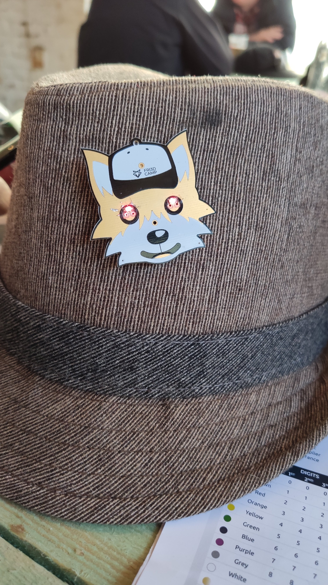

# mini-ph0xx

Design files voor de kleine badge die we op de [Maker Faire Gent 2019](http://makerfairegent.be) gebruikten om 1000 mensen te leren solderen.

De badge werd ontworpen door Wim Van Gool en Toon Vandeputte. Toon werkte een ontwerp uit in Illustrator en Wim integreerde dat met de PCB layout in Altium. Deze mini ph0xx badge is in alle opzichten de kleine broer van de [ph0xx badge](https://github.com/Fri3dCamp/badge) van Fri3d Camp 2018.

De badge heeft een through-hole design en twee SMD designs op 1 printplaat. Allen doen ze met een celbatterij twee oogjes oplichten. Met het tweede SMD circuit kan je het kopervlak rond de oortjes gebruiken als aan/uit touchpad.

Deze repository bevat 
* [De design files voor Altium](design)
* [De productiefiles van de rev.00 PCB zoals gebruikt op de Maker Faire](output/Mini-Ph0xx_00/PCB%20Production)
* [De productiefiles van de rev.01 PCB](output/Mini-Ph0xx_01/PCB%20Production)
* [Bill of Materials van de 3 circuits](output/Mini-Ph0xx_00/BOM)
* [Bill of Materials van de basic versie](output/Mini-Ph0xx_01/BOM)
* [Design in PDF formaat van rev.00](output/Mini-Ph0xx_00/Mini-Ph0xx_00.PDF)
* [Design in PDF formaat van rev.01](output/Mini-Ph0xx_01/Mini-Ph0xx_01.PDF)
* [Handleiding](Handleiding/Mini%20Ph0xx%20handleiding.pdf)
* [Iedereen kan solderen roll-up poster](Handleiding/Iedereen%20kan%20solderen.pdf)

Gebruik, copieer, verspreid!

